# Logistic Regression

## Table of Contents
- [Description](#description)
- [Prerequisite](#prerequisite)
- [Notations](#notations)
- [Defintion](#definition)
- [Hypothesis Function](#hypothesis-function)
- [Decision Boundary](#decision-boundary)
- [Cost Function](#cost-function)
- [Gradient Descent](#gradient-descent)
- [Multiclass Classification](#multiclass-classification)
- [Regularization](#regularization)

## Description
A Mathematical intuition and quick guide and understanding of how Logistic Regression Algorithm works. 

## Notations
- `m` 👉 Number of Training Examples.
- `x` 👉 "input" variable / features.
- `y` 👉 "ouput" variable / "target" variable.
- `n` 👉 Number of feature variable `(x)`
- `(x, y)` 👉 One training example.
- `x`i , `y`i  👉 ith training example.
- `x`ij 👉 ith training example of the jth column / feature.

## Definition
`Logisitic Regression` is a classification algorithm where a dependent variable `'y'` that we want to predict takes on discrete values, for example `y ϵ {0,1}`. It is the most popular and widely used.

 

### Example of Classification Problem

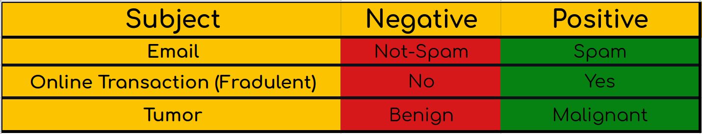

 

These are some of the area where `Logistic Regression` is used. Where we want to know whether an email recieved is `'Spam'` or `'Not-Spam'` and then place them to their predicted category. Whether the transaction is fradulent or not and whether the tumor is `'Benign'` or `'Malignant'`.
 
The way we approach to these type of classification problems where the prediction variable `'y'` does not take on continous value, is we set `'y'` to take on `'discrete values'`, for example: 
<pre align = center>y ϵ {0,1}          0 : 'Nagative Class'
                    1 :  'Positive Class' </pre>

 

We can think of predicting value `'y'` taking on two value either `'0'` or `'1'`, either `'Not-Spam'` or `'Spam'`, either `'Benign'` or `'Malignant'` etc.

 

Another name for the class that we denote with `'0'` is the `'negative class'` and another name for the class that we denote with `'1'` is `'positive class'`. So `'0'` we denote as `'Not-Spam'` and `'1'` as `'Spam'`. The assignment of these classes is arbitrary and it doesn't really matter but often there is an intuition that a `'negative class' '0'` is conveying the absence of something.

 

Classification probelms like these are also called `'Binary Classification'` problem where we have only two outputs, either `'0'` or `'1'`.

## Hypothesis Function
We could appraoch the classification problem ignoring the fact that `'y'` is discrete valued, and use [Linear Regression]( https://github.com/JuzerShakir/Linear_Regression#formula-for-univariate-linear-regression) algorithm to try to predict `'y'` given `'x'`. However, it is easy to construct examples where this method performs very poorly. And also it doesn't make sense for our `'h(x)'` to take values larger than `1` or smaller than `0` when we konw `'y ϵ {0,1}'`. To fix this, we need to change the form of our `'h(x)'` to satisfy 0 ≤ h(x) ≤ 1.
 
This is achieved by plugging θTx into the `'Logistic Function'` or also known as `'Sigmoid Function'`.

 

**Sigmoid Function:**

 

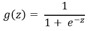

 

**Graph of Sigmoid Function: g(z) with respect to z**

 

This function has 2 horizonatal asymptotes. As `'z'` approaches to `-∞` , g(z) approaches to `0` and z approaches to `∞`, g(z) approaches to `1` and `y-intercept` is `0.5` when `'z'` is `0`. 
The function `g(z)` shown above, maps to any real number between `0` and `1` interval, making it useful for tranforming an arbitrary valued function into a fucntion better suited for classification.

 

Now lets set `'z'` to θTx and pass it to our `'h(x)'`:

 

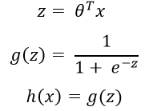

 

`h(x)` will give us the probability that our output is 1. For example, `h(x) = 0.7` gives us the probability of `70%` that our output is `1`. Here's how we interpret it:

 

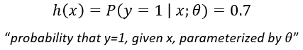

 

Since here the probability of `'y'` is `0.7` then the probability of `'y'` being `0` is `0.3` since both probability should add up to `1`. 
Here's how we can interpret it:

 

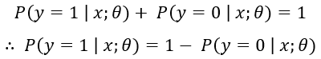

 

### Setting discrete values
We can translate the output of the `h(x)` function as follows: 

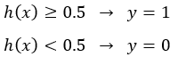
 

Because the way that our `Logistic Function g(z)` behaves is that when its input is greater than or equal to `0`, its output is greater than equal to `0.5`.

> **Note:** 
> if z = 0, then e0 = 1, ∴ g(z) = 0.5 
> if z = ∞, then e-∞ = 0, ∴ g(z) approaches 1 
> if z = -∞, then e∞ = 1, ∴ g(z) approaches 0 

So if our input to the function `g` is θTx, then that means when θTx ≥ 0, then `h(x)` ≥ 0.5. 
From all of these statements we can now say: 

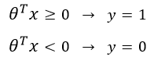
 

## Decision Boundary
The decision boundary is the line that separates the area of `y=1` and `y=0`. It is created by our hypothesis function.

### Linear Decision Boundary
For example : if 

h(x) = θ0 + θ1x1 + θ2x2 
and θ0 = 5, θ1 = -1, θ2 = 0

So `y = 1` if:

5 + (-1)x1 + 0x2 ≥ 0 
5-x1  ≥ 0  
-x1 ≥ -5  
x1 ≤ 5 
 

 

In this case our decision boundary is a straight line placed on the graph where x1 = 5 and everything to the left of that denotes `y = 1` while everything to the right of that denotes `y = 0`.

 

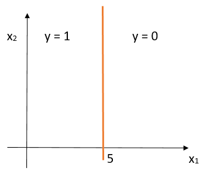

 

### Non-Linear Decision Boundary
The above input to the `Logistic or Sigmoid Function` was linear but 
θTx can also be a function that describes a circle or any other function. 

For example: 

h(x) = θ0 + θ1x12 + θ2x22 
and θ0 = -1, θ1 = 1, θ2 = 1

So `y = 1` if:

-1 + x12 + x22 ≥ 0 
or  
x12 + x22 ≥ 1 
 

 

So if we were to plot the decision boundary of this, it would be a circle with radius 1 centered at the origin.

 

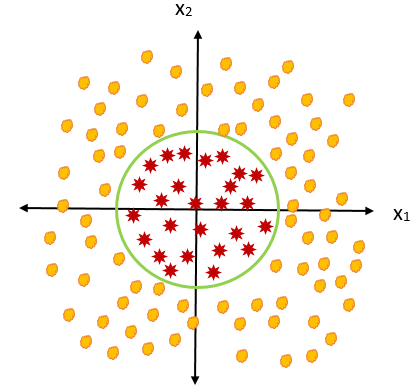
 

Everything outside the circle is `y=1` and inside is `y=0`.

> **Note:** 
> We do not need to define the decision boundary. The training set will fit the parameters θ and once you have them then that will define decision boundary.

## Cost Function
If we choose the cost function of [Linear Regression](https://github.com/dsmentors/Machine_Learning_study_Materials/blob/main/Algorithms/Supervised/Regression/README.md) (MSE), it turns out that this would not guarantee that when we run Gradient Desccent, it will converge to global minimum because here our hypothesis function `h(x)` is not linear, it is a sigmoid function and when we plot `J(θ)` with respect to `θ`, this is what it looks like: 

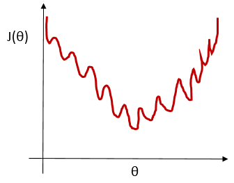
 
Since this is has many local minimum, the Gradient Descent will not guarantee to converge to global minimum. We can also call this as non-convex function. We need a convex function which has no local minimum but one globla minimum.

 

Our cost function for Logistic Regression: 

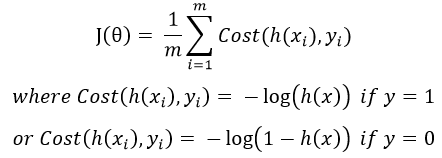
 

When `y=1`, we get the following plot for `J(θ)` vs `h(x)`: 

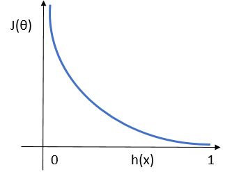
 

Few interesting properties about this we see are:

if y = 1 and h(x) = 1, then Cost J(θ) = 0 
But as h(x) approaches 0, Cost approaches ∞
 

Similarly When `y = 0`, we get the following plot for `J(θ)` vs `h(x)`: 

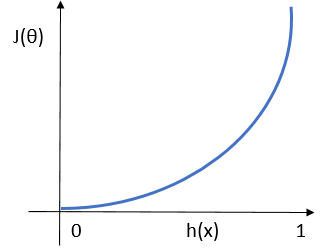
 

Few interesting properties about this we see are:

if y = 0 and h(x) = 0, then Cost J(θ) = 0 
But as h(x) approaches 1, Cost approaches ∞
 

Writing the cost function this way guarantees that J(θ) is convex for logistic regression. 

We can compress our `Cost Function's` two conditional cases into one case: 

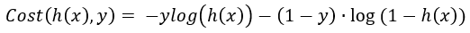
 

Notice that when `y=1`, then the second term will be zero and will not affect the result. And if `y=0`, then the first term will be zero and will not affect the result. 
Therefore, our `Cost function` is : 

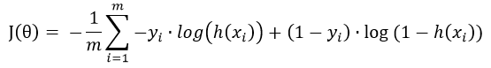
 

## Gradient Descent
General form of Gradient Descent : 

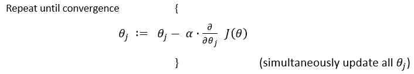
 
Working out the derivative part using Calculus we get: 

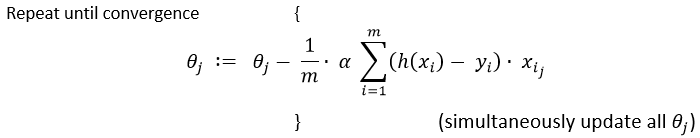
 

This algorithm looks similar to [Gradient Descent of Linear Regression](https://github.com/dsmentors/Machine_Learning_study_Materials/blob/main/Algorithms/Supervised/Regression/README.md) but its not since `h(x)` here is a `logistic/sigmoid function` and `h(x)` in `linear regression` is θTx.

## Multiclass Classification
Now we will approach the classification of data when we have more than `2 categories`. Instead of y ϵ {0,1} we will expand our definition so that y ϵ {0,1,2....,n}. 
We need to predict the probability that `y` is a member of one of our classes from {0,1,2....,n}. 

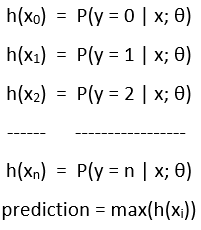
 

We apply `Logistic Regression` to each class, and then choose hypothesis which returned the highest probability and use to predict new `x` value.

## Regularization
Let's say that we have a function: 
h(x) = g(θ0 + θ1x1 + θ2x12 + θ3x12x2 + 
θ4x12x22 + 
θ5x12x23
............) 
and it fits the data as follows: 

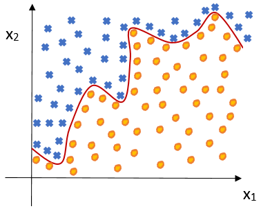
 
As we can clearly see this function overfits the data and will not generalize well for new or unseen data.

### Cost Function for Regularization
We'll want to eliminate the influence of the parameters without actually getting rid of these features or changing the form of the hypothesis function. We instead modify our `Cost function.` 
Our Cost Function was: 

 

We can regularize this equation by adding a term to the end: 

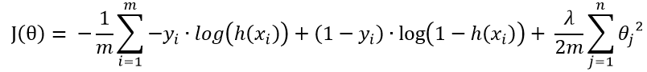
 

The second sum, 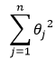, means to explicitly exclude the bias term, θ0, i.e the θ vector is indexed from 0 to n (holding n+1 values, θ0 through θn), and this sum explicitly skips θ0, by running from 1 to n. Thus, when computing the equation, we should continously update the 2 following equation:

### Gradeint Descent

 

This may look identical to [Linear Regression's regularization Gradient Descent](https://github.com/dsmentors/Machine_Learning_study_Materials/blob/main/Algorithms/Supervised/Regression/README.md) but the hypothesis function is different, here we have `Sigmoid or Logistic Function` and for Linear we have θTx.
