# Linear Regression

## Table of Contents

- [Description](#description)
- [Notations](#notations)
- [Definition](#definition)
- [Flowchart](#flowchart)
- [Univariate Linear Regression](#univariate-linear-regression)
    - [Definition](#definition-for-univariate-linear-regression)
    - [Formula](#formula-for-univariate-linear-regression)
    - [Cost Function](#cost-function-for-univariate-linear-regression)
    - [Gradient Descent](#gradient-descent-for-univariate-linear-regression)
- [Multivariate Linear Regression](#multivariate-linear-regression)
    - [Definition](#definition-for-multivariate-linear-regression)
    - [Formula](#formula-for-multivariate-linear-regression)
    - [Cost Function](#cost-function-for-multivariate-linear-regression)
    - [Gradeint Descent](#gradient-descent-for-multivariate-linear-regression)
- [Feature Scaling and Mean Normalization](#feature-scaling-and-mean-normalization)
- [Bias - Variance](#bias---variance)
    - [High Bias](#high-bias)
    - [Just Right](#just-right)
    - [High Variance](#high-variance)
- [Resolving High Variance](#resolving-high-variance)
    - [Cost Function](#cost-function-for-regularization)
    - [Gradeint Descent](#gradient-descent-for-regularization)

## Description
A Mathematical intuition and quick guide and understanding of how Linear Regression Algorithms works. Given links to other study materials in order to understand the concepts more concretly.

## Notations
- `m` 👉 Number of Training Examples.
- `x` 👉 "input" variable / features.
- `y` 👉 "ouput" variable / "target" variable.
- `n` 👉 Number of feature variable `(x)`
- `(x, y)` 👉 One training example.
- `x`i , `y`i  👉 ith training example.
- `x`ij 👉 ith training example of the jth column / feature.

-----

## Definition
A linear equation that models a function such that if we give any `x` to it, it will predict a value `y` , where both `x and y` are input and output varaibles respectively. These are numerical and continous values.

It is the most simple and well known algorithm used in machine learning.

## Flowchart 

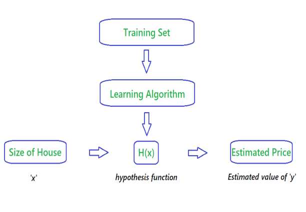

 

The above Flowchart represents that we choose our training set, feed it to an algorithm, it will learn the patterns and will output a function called `Hypothesis function 'H(x)'`. We then give any `x` value to that function and it will output an estimated `y` value for it.

For historical reasons, this function `H(x)` is called `hypothesis function.`

-----

## Univariate Linear Regression
### Definition for Univariate Linear Regression
When you have one feature / variable `x` as an input to the function to predict `y`, we call this `Univariate Linear Regression` problem.

### Formula for Univariate Linear Regression

H(x) = θ0 + θ1x

Other way of representing this formula as what we are familiar with:

H(x) = b + mx

> Where :
>- b = θ0 👉 y intercept
>- m = θ1 👉 slope
>- x = x 👉 feature / input variable

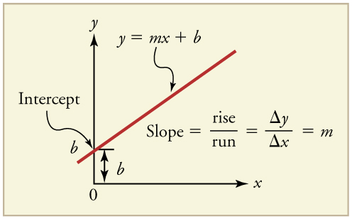

 

### Cost Function for Univariate Linear Regression
All that said, how do we figure out the best possible straight line to the data that we feed?

**This is where `Cost Function` will help us:**

The best fit line to our data will be where we have least distance between the `predicted 'y' value` and `trained 'y' value`.

#### Formula for Cost Function

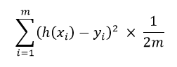

> Where :
>- h(xi) 👉 hypothesis function
>- yi 👉 actual values of `y`
>- 1/m 👉 gives Mean of Squared Errors
>- 1/2 👉 Mean is halved as a convenience for the computation of the `Gradient Descent`.

The above formula takes the sum of the distances between <i>`predicted values` and `actual values` of training set, sqaure it, take the average and multiply it by `1/2`.</i>
 
 
This cost function is also called as `Squared Error Function` or `Mean Squared Error`.
 
 
🙋‍ Why do we take squares of the error's? 
The `MSE` function is commonly used and is a reasonable choice and works well for most Regression problems.
 
 
Let's subsititute `MSE` function to function `J` :

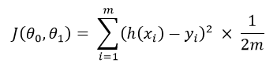

 
 

### Gradient Descent for Univariate Linear Regression
So now we have our hypothesis function and we have a way of measuring how well it fits into the data. Now we need to estimate the parameters in the hypothesis function. That's where `Gradient Descent` comes in. 
`Gradient Descent` is used to minimize the cost function `J`, minimizing `J` is same as minimizing `MSE` to get best possible fit line to our data.

#### Formula for Gradient Descent

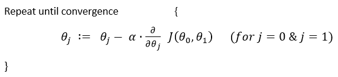

> Where :
>- `:=` 👉 Is the Assignment Operator
>- `α` 👉 is `Alpha`, it's the number which is called learning rate. If its too high it may fail to converge and if too low then descending will be slow.
>- 'θj' 👉 Taking Gradient Descent of a feature or a column of a dataset.
> - ∂/(∂θj) J(θ0,θ1) 👉 Taking partial derivative of `MSE` cost function.

 
 

 
 

**Now Let's apply Gradient Descend to minmize our `MSE` function.**
 
In order to apply `Gradient Descent`, we need to figure out the partial derivative term. 
So let's solve partial derivative of cost function `J`.

 

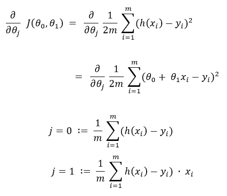

 

Now let's plug these 2 values to our `Gradient Descent`:

 

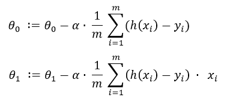

 

> **Note :** 🚩 
> - Cost Function for Linear Regression is always going to be Convex or Bowl Shaped Function, so this function doesn't have any local minimum but one global minimum, thus always converging to global minimum.
> - The above hypothesis function has 2 parameters, θ0 & θ1, so Gradient Descent will run on each feature, hence here two times, one for feature and one for base `(y-intercept)`, to get minimum value of `j`. So if we have `n` features, Gradient Descent will run on all `n+1` features.

-----

## Multivariate Linear Regression

### Definition for Multivariate Linear Regression
Its same as `Univariate Linear Regression`, except it has more than one feature variable `(x)` to predict target variable `(y)`.

### Formula for Multivariate Linear Regression
Our hypothesis function for `n` = 4 :

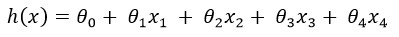

 

> Where :
>- θ0 👉 y intercept
> - And rest are features `x` to help predict `y` value.
>> **Intuition:** 
>>In order to develop an intuition about this function, let's imagine that this function represents price of a house `(y)` based on the features given `(x)`, then we can think of this function as:
>> - θ0 as the basic price of a house.
>> - θ1 as price/m2.
>> - x1 as area of a house (m2).
>> - θ2 as price/floor.
>> - x2 as number of floors.
>> - etc _(You get the idea)_

 
 

Let's set all the parameters:

<b> θ0, θ1, θ2, θ3.......θn = θ </b>

 
And Let's set all the features:

<b> x0, x1, x2, x3.......xn = x </b>

 

> Where :
>- θ 👉 will be `n+1` dimensional vector because we have θ0 which is not a feature.
> - x0 👉 is added just for convenience so that we can take matrix multiplication of `θ` as θT and `x` and we will set x0 value to 1, so this doesn't change the values.
> - x 👉 will also be `n+1` dimensional vector.

 
 

### Cost Function for Multivariate Linear Regression

So, 

J(θ0, θ1, θ2, θ3.......θn) = J(θ)

 
Where,

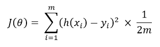

 
 

### Gradient Descent for Multivariate Linear Regression

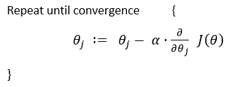

 
 

**Appling Gradient Descend to minmize our `MSE` function after solving partial derivative of J(θ), we get :**
 

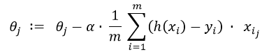

 
 

**For Example : If we had 2 features, this is how gradient descent would run on each parameter:**

 

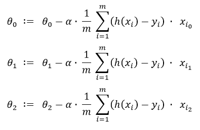

 

------

## Feature Scaling and Mean Normalization

We can speed up `Gradient Descent` by having each of our input values in roughly the same range. This is because `θ` will descend quickly on small ranges and slowly on large ranges. If we have large ranges, it will oscilate inefficiently down to optimum (minimum) when the variables are very uneven.

 

The way to prevent this is to modify the ranges of our input variables so that they are all roughly the same. Ideally between :

-1  ≤  xi  ≤  1

OR

-0.5  ≤  xi  ≤  0.5

 

These aren't exact requirements, we are only trying to speed things up. The goal is to get all input variables into roughly one of these ranges. 
This can make `Gradient Descent` run much faster and converge in a lot few iterations.

 

 Two techniques to help with this are `Feature Scaling` and `Mean Normalization`.</b>

- `Feature Scaling` involves diving the input values by the range (i.e max value - min value) of the input variable, resulting in a new values.

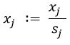

- `Mean Normalization` involves subtracting the average of a feature variable from the values of the feature, dividing by _range_ of values or by _standard deviation_, resulting in a new values.

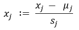

> Where:
> - μj 👉 Average of a Feature variable `j`.
> - si 👉 Either `Range` or `Standard Deviation` of a Feature `j`.

-----

## Bias - Variance

### High Bias

Consider a problem of predicting `y`. The figure below shows the result of fitting a `hypothesis function` θ0 + θ1x to a dataset.

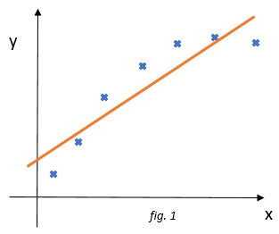

We see that the data doesn't really lie on a straight line and so the fit is not very good. 
This figure is an instance of `Underfitting`, in which the data clearly shows structure not captured by the model `h(x)`. 
`Underfitting` or `high bias` is when the form of our `h(x)` function maps poorly to the trend of the data. It is usually caused by a function that is too simple or uses too few features.

-----

### Just Right

If we add an extra feature x2 and fit `hypothesis function` θ0 + θ1x + θ2x2, then we obtain a slightly better fit to the data.

 

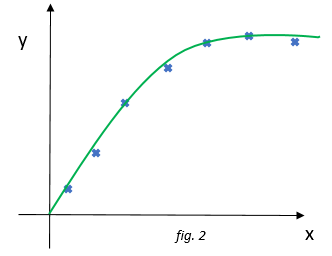

 

------

### High Variance

If we add more features, it would intuitively seem that it could perform much better, however there's also a danger in adding too amny features. The result of fitting 4th order polynomial where our `h(x)` is  θ0 + θ1x + θ2x2 + θ3x3 + θ4x4

 

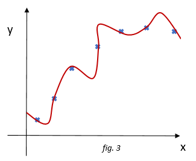

 

We see that even though the fitted curve passes through the data perfectly, we would not expect this to be a very good predictor of for example housing prices `y` for different areas `x`.

 

`Overfitting` or `High Variance`, is caused by `h(x)` function that fits the available data but does not generalize (unable to accurately predict) well to predict new data. It is usually caused by giving too many features or having a complicated `h(x)` function that creates lots of unnecessory curves and angles unrelated to the data.

 

## Resolving High Variance

There are 2 main options to address the issue of Overfitting:

- **Regularization**
    - Keep all features, but reduce the magnitude of parameters θj.
    - It works well when we have a lot of slightly useful features.
- **Reduce number of features**
    - Manually select which features to keep.
    - Use `model selection` algorithm.

 

### Cost Function for Regularization

If we have overfitting from our `hypothesis function`, for example like in figure 3, we can reduce the weight that some of the terms in our function carry by increasing their cost.
 
For example, let's say we wanted to make the following function more quadratic: 
θ0 + θ1x + θ2x2 + θ3x3 + θ4x4 
We'll want to eliminate the influence of θ3x3 and θ4x4, without actually getting rid of these features or changing the form of our hypothesis, we can instead modify our cost function. 

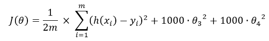
 

We've added two extra terms at the end to inflate the cost of θ3 and θ4. Now, in order for the cost function to get close to `0`, we will have to reduce the values θ3 and θ4 to near `0`. This will in turn greatly reduce the values of θ3x3 and θ4x4 in our `hypothesis function`. 

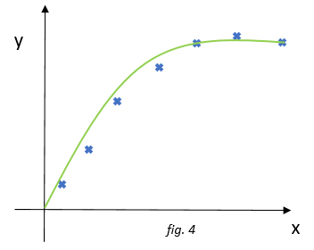
 

As a result we see that the new `H(x)` looks like a quadratic function but fits the data better compared to _figure 3_ due to extra small terms θ3x3 and θ4x4.

 
 

We can also regularize all of our parameters in a single summation as:
 

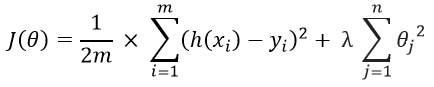
 

The `λ`, or `lambda`, is regularization parameter. It determines how much costs of our `θ` parameters are inflated. 
Using the above cost function with the extra summation, we can smooth the output of our hypothesis function to reduce overfitting. If `lambda` is choosen to be too large, it may smooth our function too much and causing `High bias` or `Underfitting`.

> **Note:** 
> We penalize the parameters from θ1 .... θn , but we don't penalize θ0. We treat this differently.

------

 

### Gradient Descent for Regularization

We will modify our gradient descent function to separate out θ0 from rest of the parameters because we do not want to penalize θ0.

 

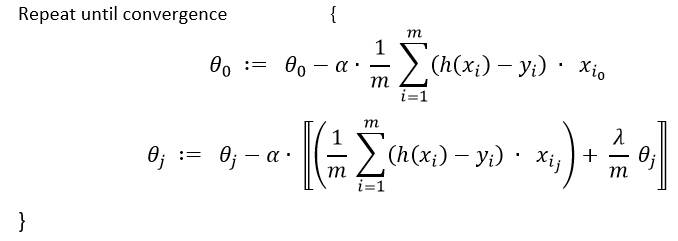
 

The term λ/m times θj performs our regularization. 

With some manipulation our updated Gradient Descent for θj can also be represented as: 

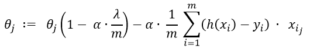
 

The first term in the equation 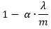 will always be less than 1. Intuitively you can see it as reducing the value θj by some amount on every update. And the second term is exactly the same as it was in `Gradient Descent` without applying regularization.

-----
